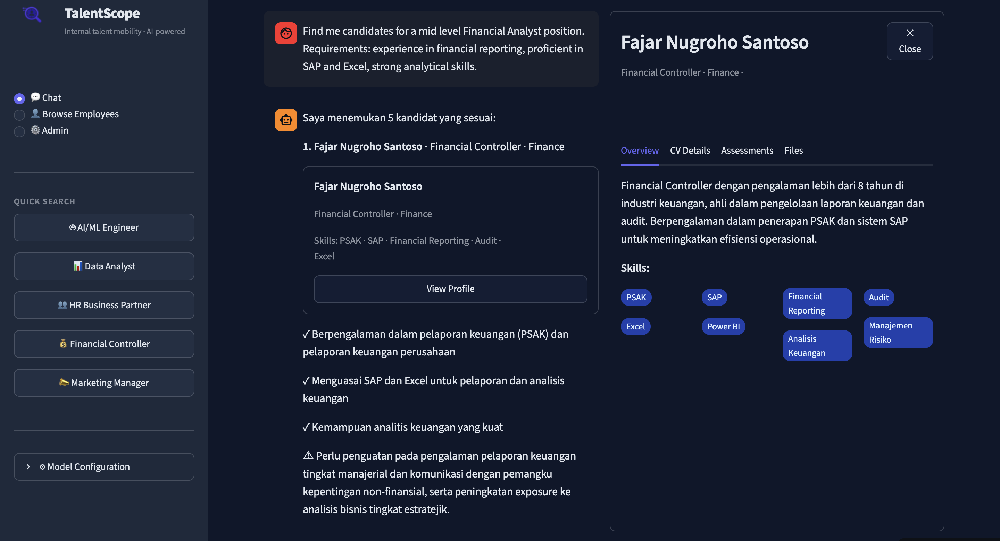
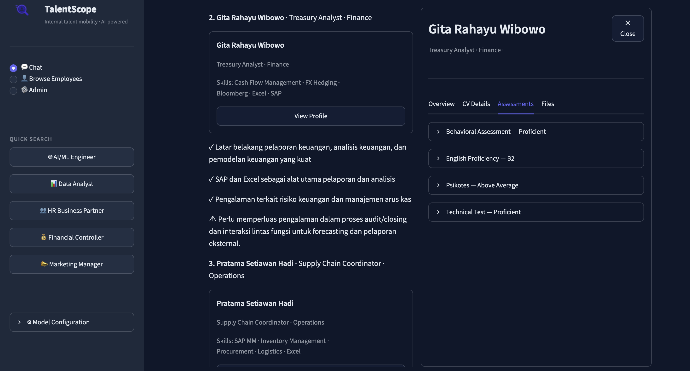
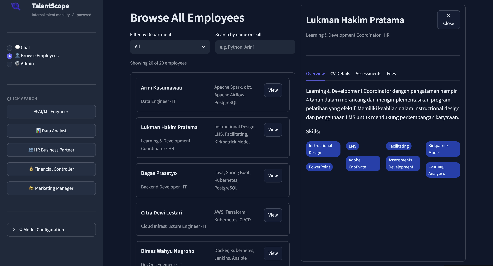

# TalentScope

**Proof of Concept** — AI-powered internal talent mobility tool. HR describes a vacancy in natural language and an agent searches the employee database to return ranked candidates with reasoning — no manual CV review required.

Built as a portfolio project demonstrating end-to-end AI engineering: document parsing, semantic search, multi-tool LLM agents, and a purpose-built Streamlit UI. This PoC uses synthetic employee data and is not intended for production use.


---

## Features

- **Chat with an agent** — HR types requirements in Indonesian or English; the agent clarifies if needed, then searches and ranks candidates
- **Inline candidate cards** — results appear directly in the chat with match score, reasons, and gaps
- **Full profile view** — click any card to open a split panel with CV details, assessment results (psychotest, technical, behavioral, English proficiency), and downloadable files
- **Browse all employees** — filter and search the full database independently of chat
- **Any CV format** — parser uses LLM vision to handle any layout, language, or file format
- **Any LLM provider** — swap between OpenAI, Anthropic, Groq, or Ollama from the sidebar without restarting
- **Multi-user sessions** — each browser tab is isolated; conversation history persists across refreshes via SQLite

---

## Screenshots

**Chat — agent returns ranked candidates with inline cards**


**Chat — candidate profile open with assessments**


**Browse All Employees — filter and view profiles**


---

## Architecture

```
HR Chat Input
     │
     ▼
┌─────────────────────────────────────┐
│  Agent (direct tool-calling loop)  │
│  • Clarifies vague queries          │
│  • Calls tools when ready           │
└──────────────┬──────────────────────┘
               │ tools
       ┌───────┼────────────────┐
       ▼       ▼                ▼
  search   get_detail      filter /
candidates  (by ID)        compare
       │
       ▼
┌─────────────────┐    ┌──────────────────────┐
│   ChromaDB      │    │  Candidate Profiles  │
│  (2 docs/emp:   │◄───│  ParsedCV +          │
│   CV + assess.) │    │  ParsedAssessment[]  │
└─────────────────┘    └──────────────────────┘
                                ▲
                    ┌───────────┘
                    │  Ingestion Pipeline
                    │  PDF/image → LLM vision → normalized schema
                    │  → embedding → ChromaDB
```

**Key design decisions:**
- **No agent framework** (no LangGraph, no CrewAI) — a plain Python tool-calling loop is simpler, more transparent, and easier to debug
- **LiteLLM** for provider-agnostic LLM/embedding calls — one interface for OpenAI, Anthropic, Groq, Ollama
- **2 ChromaDB documents per employee** (CV + assessments) — improves recall for skill-focused vs. behavioral-focused queries
- **LLM vision parser** — handles any CV format without template/regex fragility
- **Pre-built ChromaDB committed to git** — no cold-start re-ingestion on Streamlit Cloud

---

## Stack

| Layer | Technology |
|-------|-----------|
| UI | Streamlit |
| LLM / Embeddings | LiteLLM (OpenAI / Anthropic / Groq / Ollama) |
| CV & Assessment Parsing | LiteLLM vision API + PyMuPDF |
| Vector Database | ChromaDB (persistent) |
| Session Storage | SQLite |
| Synthetic PDF Generation | reportlab |
| Package Manager | uv |
| Tests | pytest + pytest-mock |

---

## Quickstart

### Prerequisites

- Python 3.11+
- [uv](https://docs.astral.sh/uv/getting-started/installation/)
- An API key for at least one LLM provider (OpenAI recommended)

### Setup

```bash
git clone <repo-url>
cd candidate-finder

# Install dependencies
uv sync --dev

# Configure environment
cp .env.example .env
# Edit .env — set your OPENAI_API_KEY (or LLM_API_KEY for other providers)
```

### Run the app

The ChromaDB is pre-built and committed — you can run immediately:

```bash
uv run streamlit run app.py
```

Open http://localhost:8501.

---

## Data Generation (optional)

To regenerate the synthetic employee dataset or re-ingest:

```bash
# 1. Generate job descriptions (scrapes Indeed, falls back to LLM generation)
uv run python scripts/scrape_job_descriptions.py

# 2. Generate 20 synthetic employee CVs + assessment PDFs
uv run python scripts/generate_synthetic_data.py

# 3. Parse all CVs/assessments and build ChromaDB
uv run python scripts/run_ingestion.py
```

Ingestion makes ~5 LLM vision API calls per employee (1 CV + 4 assessments). With 20 employees, expect ~10–15 minutes depending on rate limits.

### Adding your own employees

Create a folder under `data/employees/`:

```
data/employees/
└── emp_022_yourname/
    ├── cv.pdf                   # any format, any language
    └── assessments/
        ├── psychotest.pdf       # optional
        ├── technical.pdf        # optional
        ├── behavioral.pdf       # optional
        └── english.pdf          # optional
```

Then re-run ingestion:

```bash
uv run python scripts/run_ingestion.py
```

---

## Testing

```bash
# Unit tests only (no API key required)
uv run pytest -m "not integration" -v

# All tests including integration (requires API key + populated ChromaDB)
uv run pytest -v
```

### Agent Quality Tests (`tests/test_agent_quality.py`)

Three layers of correctness checks for the agent:

| Layer | Class | What it checks | Needs API key |
|-------|-------|---------------|--------------|
| 1 — Retrieval | `TestRetrievalCorrectness` | `search_candidates` returns expected employee IDs for confirmed queries | Yes (embeddings) |
| 2 — Clarification (unit) | `TestAgentClarificationBehavior` | Mocked LLM: vague queries don't dispatch tools; specific ones do | No |
| 2 — Clarification (integration) | `TestAgentClarificationBehaviorIntegration` | Real LLM: vague queries produce a `?`, not candidate cards | Yes |
| 3 — End-to-end | `TestAgentEndToEnd` | Real LLM + real ChromaDB: correct `__CANDIDATE_CARD__:emp_XXX` tokens appear | Yes |

The end-to-end tests use a multi-turn helper: if the agent clarifies on turn 1, a fallback reply is sent before asserting on the candidate cards. Ground-truth employee IDs in all assertions were verified by running real queries before the tests were written — not assumed.

```bash
# Unit quality tests only
uv run pytest tests/test_agent_quality.py -m "not integration" -v

# Full quality suite (integration)
uv run pytest tests/test_agent_quality.py -v
```

---

## Model Configuration

Switch providers from the sidebar at runtime, or set defaults in `.env`:

| Provider | Example model string | Required env var |
|----------|---------------------|-----------------|
| OpenAI | `openai/gpt-5-nano` | `OPENAI_API_KEY` |
| Anthropic | `anthropic/claude-haiku-4-5-20251001` | `ANTHROPIC_API_KEY` |
| Groq | `groq/llama-3.3-70b-versatile` | `GROQ_API_KEY` |
| Ollama | `ollama/qwen2.5` | `LLM_BASE_URL=http://localhost:11434` |

The vision model (for CV parsing) and embedding model can be set independently in `.env`.

---

## Deployment (Streamlit Community Cloud)

1. Fork or push this repo to GitHub
2. Go to [share.streamlit.io](https://share.streamlit.io) → New app → select repo → entry point: `app.py`
3. Add secrets in the Streamlit dashboard:

```toml
OPENAI_API_KEY = "sk-..."       # or your preferred provider key
ADMIN_PASSWORD = "yourpassword" # protects the Admin panel
```

4. Deploy

The `chroma_db/` directory is committed — no ingestion step needed on the server.

### First-time setup after deploy

The Chat view requires an access key. To generate one:

1. Open the app → go to **Admin** in the sidebar
2. Log in with your `ADMIN_PASSWORD`
3. Click **Generate Key** → copy the key shown
4. Go to **Chat** → enter the key

For personal use, you only need to do this once. For sharing with others, generate a separate key per person — keys expire after 24 hours and can be revoked from the Admin panel.

> **Note:** `data/employees/emp_001_shobur/` is gitignored (contains a real personal CV). The synthetic employees (emp_002–emp_021) are committed.

---

## Project Structure

```
candidate-finder/
├── app.py                    # Streamlit entry point
├── pyproject.toml            # Dependencies (uv)
├── .env.example
│
├── config/settings.py        # pydantic-settings config
├── core/
│   ├── schemas.py            # Pydantic models (CV, Assessment, Profile, Match)
│   ├── parser.py             # LLM vision document parser
│   └── embedder.py           # LiteLLM embedding wrapper
├── ingestion/
│   ├── chromadb_store.py     # Vector store (upsert, search, get)
│   ├── pipeline.py           # Ingestion orchestrator
│   └── file_loader.py        # Employee folder discovery
├── agent/
│   ├── agent.py              # Tool-calling loop
│   ├── tools.py              # Tool implementations + schemas
│   └── prompts.py            # System prompt + tool descriptions
├── session/store.py          # SQLite session persistence
├── ui/
│   ├── sidebar.py            # Model config + quick searches
│   ├── chat_panel.py         # Chat history + inline cards
│   ├── candidate_card.py     # Inline card component
│   ├── detail_panel.py       # Full profile (CV / Assessments / Files tabs)
│   └── browse_view.py        # Browse all employees
├── scripts/
│   ├── scrape_job_descriptions.py
│   ├── generate_synthetic_data.py
│   └── run_ingestion.py
└── tests/                    # 55 unit + integration tests
```

---

## License

MIT
